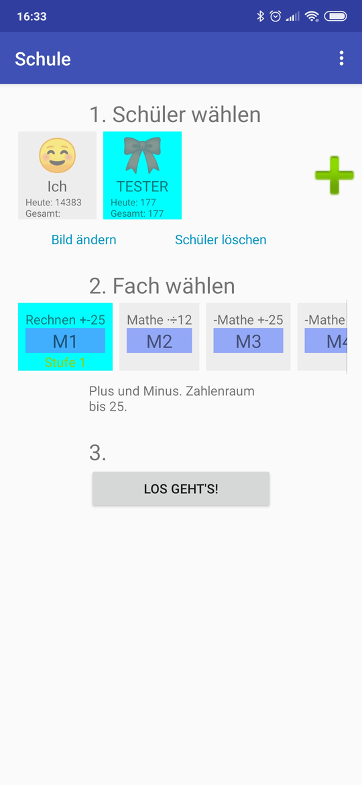
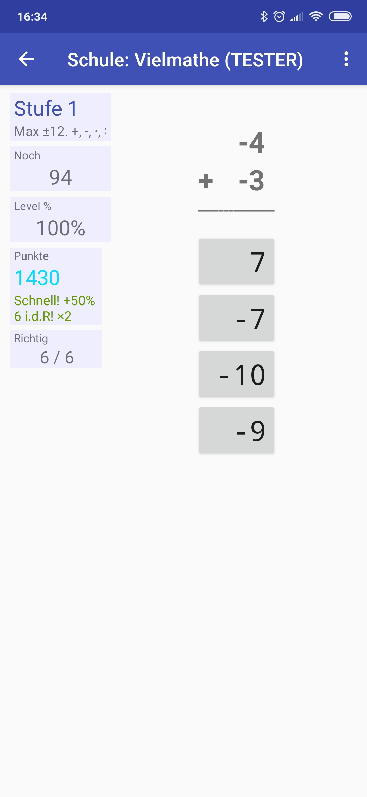
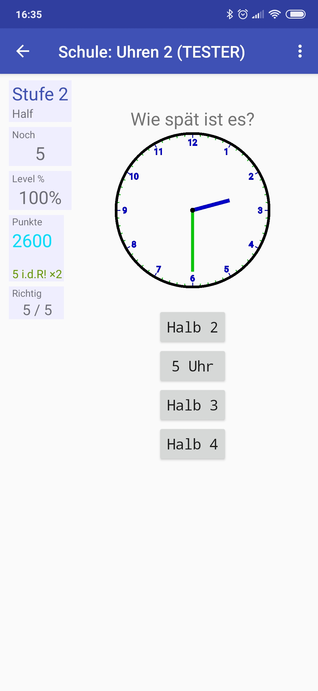

# Schule

Eine einfache spielerische App um Grundschulaufgaben zu trainieren.

Es ist eine deutsche Übersetzung von https://github.com/quaap/Primary

In Version 0.2 mit Mathe und Rechtschreibung.

Version 0.3 mit der Uhr (12 Stunden).

Ein Debug-APK ist auf [Releases](https://github.com/ailin-nemui/Primary/releases) angehängt. You can find the latest installable version on [FDroid](https://f-droid.org/repository/browse/?fdid=com.quaap.primary).

Vielleicht kommen irgendwann noch mehr Aufgaben hinzu. ( allerdings macht
der Entwickler des Originals gerade eine länger Pause )

Ideen: Wörter, Brüche, digitale Uhr, usw. und andere Fächer: Geografie, Geometrie, usw.?

(Hinweis: Ewige Beta.)

Features:
* Progressive Level.
* Spielerische Klänge.
* Hinweise werden nach einiger Zeit eingeblendet.
* Mehrere Schülerprofile in einer App.
* Große Übersicht des Fortschritts.
* Kann den Fortschritt auch in CSV Dateien aufzeichnen (z.B. für Homeschooling).

Mathe:
* Addition, Subtraktion, Multiplikation, und Division.
* Multiple-Choice Antworten und Eingabe der Antwort über Bildschirmtastatur.
* Sortieren von Zahlen aus den Zahlenräumen 10, 100 und 1000.

Deutsch:
* Rechtschreibung (benutzt die Android Sprachausgabe.)
* Multiple-Choice Antworten und Eingabe der Antwort über Bildschirmtastatur.

